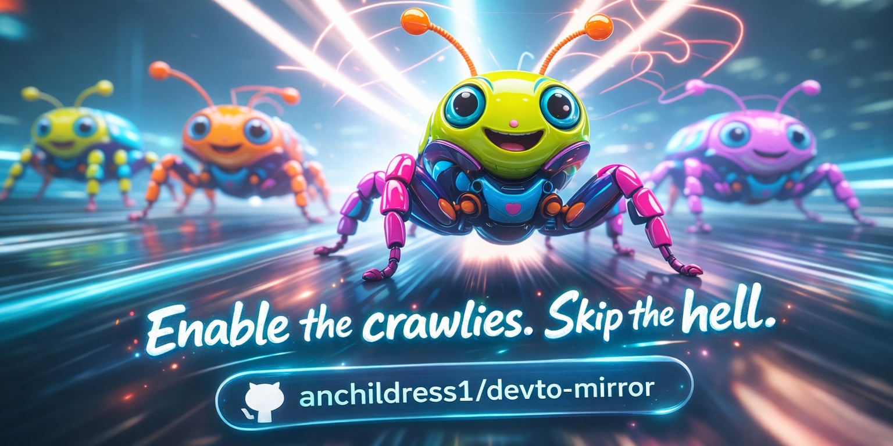
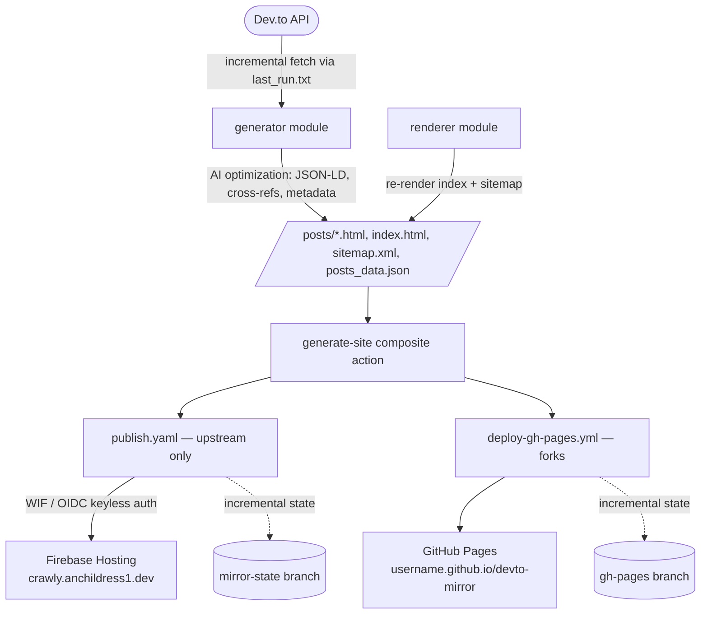

# Dev.to Mirror—The Set-and-Forget AI Crawler

🔗 **Live Site:** [crawly.anchildress1.dev](https://crawly.anchildress1.dev)



This Copilot generated utility helps make your Dev.to blogs more discoverable by search engines by automatically generating and hosting a mirror site with generous `robots.txt` rules. Avoiding Dante's DevOps and the maintenance headache. This is a simple html, no frills approach with a sitemap and robots.txt—_that's it_ (although I'm slowly working through enhancements). If you're like me and treat some comments as mini-posts, you can selectively pull in the ones that deserve their own page.

> [!NOTE]
>
> I'm slowly accepting that one or two brave souls might actually read my strong (and usually correct) opinions. 😅 I'm also always looking for ways to improve AI results across the board, because... well, _somebody_ has to. 🧠
>
> The internet already changed—blink and you missed it. We don't Google anymore; we ask ChatGPT (the wise ones even ask for sources). 🤖
>
> - **When I searched**: my [Dev.to](https://dev.to/anchildress1) showed up just as expected
> - **When I asked Gemini and ChatGPT the same thing**: crickets. 🦗
>
> So yeah, obvious disconnect... Also, I'm _not_ hosting a blog on my domain (I'm a backend dev; hosting a pretty blog + analytics sounds like a relaxing afternoon with Dante's DevOps. Hard pass. 🔥🫠), but I still want control of `robots.txt.`
>
> **Enter the five-minute ChatGPT fix:** a tiny static mirror with canonicals back to **Dev.to**—no fuss—just (practically) instantly crawlable 😉🐜.
>
> P.S. "Five minutes" usually means two hours. Acceptable losses. 😅 And seriously, writing this blurb took longer than the code. 🤨 Alright.... **3 hours** (it took me an hour to get the picture just right, enough anyway) and lots of follow up work. Still worth it! 😅
>
>—Ashley 🦄

## Repo Stuff

[](./LICENSE)   

[](https://github.com/anchildress1/devto-mirror/actions/workflows/publish.yaml) [](https://github.com/anchildress1/devto-mirror/actions/workflows/codeql.yml) [](https://github.com/anchildress1/devto-mirror/actions/workflows/security-ci.yml)

     

 

  

 [](https://www.buymeacoffee.com/anchildress1) [](https://dev.to/anchildress1) [](https://www.linkedin.com/in/anchildress1/) [](https://medium.com/@anchildress1) [](https://www.reddit.com/user/anchildress1/)

---

## What is this?

Auto-generates a static mirror of your Dev.to blog with a generous `robots.txt` for AI crawlers. Plain HTML, sitemap, canonical links back to Dev.to—zero maintenance. Every page is enriched with JSON-LD structured data and cross-reference metadata so search engines and LLMs can actually parse it.

It runs on a schedule, fetches only what changed since last time, and deploys itself. You set two repo variables and walk away.

---

## Tech Stack

| Layer | What's used |
| --- | --- |
| Language | Python **3.12+** |
| Package manager | [`uv`](https://docs.astral.sh/uv/) (locked, reproducible) |
| Templating | Jinja2 → static HTML |
| Content safety | `bleach` HTML sanitization |
| Upstream deploy | **Firebase Hosting** (keyless, via Workload Identity Federation) |
| Fork deploy | **GitHub Pages** (`gh-pages` branch) |
| CI/CD | GitHub Actions (composite action shared by both deploy paths) |
| Analytics (optional) | Firebase Analytics (GA4), opt-in via `FIREBASE_WEB_CONFIG` |
| Quality gates | Black, flake8, isort, bandit, pip-audit, detect-secrets, radon, Lefthook |

---

## Architecture

One generation pipeline, two deploy targets. The upstream repo (owner `anchildress1`) ships to Firebase; **forks ship to GitHub Pages**. A shared composite action guarantees both produce identical output, and incremental state lives on a separate branch from the deployed site.



---

## Quick Setup ⚡

These steps cover the **fork path** (GitHub Pages)—what almost everyone wants. The Firebase path is upstream-only; see [Configuration](#configuration) for those extras.

1. **Fork** this repo.
2. **Set repository variables** (Settings → Secrets and variables → Actions → Variables):
   - `DEVTO_USERNAME` – your Dev.to username
   - `GH_USERNAME` – your GitHub username (required unless you set a custom domain)
   - `SITE_DOMAIN` – _(optional)_ custom domain like `crawly.anchildress1.dev`
3. **(Optional) Set a secret** (same page → Secrets):
   - `DEVTO_KEY` – only needed for private/draft posts
4. **Update** `comments.txt` to pick which comments become standalone pages (or delete it).
5. **Run the workflow**: Actions → **Deploy Dev.to Mirror to GitHub Pages** → Run workflow. This creates the `gh-pages` branch.
6. **Enable Pages**: Settings → Pages → Deploy from a branch → `gh-pages`.

After that it pulls new content automatically every **Wednesday at 14:40 UTC** (≈09:40 ET in winter, 10:40 ET during DST).

> [!IMPORTANT]
> Forks publish to GitHub Pages via `deploy-gh-pages.yml`, with incremental state riding along on the `gh-pages` branch. The upstream repo deploys to **Firebase Hosting** (`publish.yaml`) and keeps its state on a separate `mirror-state` branch. To force a complete refresh, trigger the workflow with the `force_full_regen` option.

---

## Configuration

Everything is driven by repository variables and secrets—no config files to edit.

### Everyone (fork or upstream)

| Name | Type | Required | Purpose |
| --- | --- | --- | --- |
| `DEVTO_USERNAME` | Variable | ✅ | Dev.to profile to mirror |
| `GH_USERNAME` | Variable | ✅ (unless `SITE_DOMAIN` set) | Builds the GitHub Pages URL |
| `SITE_DOMAIN` | Variable | optional | Custom domain; overrides the Pages/Firebase URL |
| `DEVTO_KEY` | Secret | optional | Dev.to API key—only for private/draft posts |

### Upstream-only (Firebase deploy)

| Name | Type | Required | Purpose |
| --- | --- | --- | --- |
| `GCP_WORKLOAD_IDENTITY_PROVIDER` | Variable | ✅ for Firebase | Full WIF provider resource name (keyless auth) |
| `GCP_DEPLOY_SERVICE_ACCOUNT` | Variable | ✅ for Firebase | Deploy SA email (needs `roles/firebasehosting.admin`) |
| `FIREBASE_PROJECT_ID` | Variable | optional | Firebase project id (defaults to `anchildress1`) |
| `FIREBASE_WEB_CONFIG` | Variable | optional | Firebase web config JSON; enables **opt-in** GA4 Analytics when set |

> [!NOTE]
> The Firebase web config is **public by design**—it's safe as a plain repo variable, not a secret. Analytics stays dormant until `FIREBASE_WEB_CONFIG` is set, so forks ship zero tracking.

---

## How it works

Fetches posts via the Dev.to API (incremental updates tracked in `last_run.txt`), then generates **plain HTML** with canonical links back to Dev.to, AI-specific structured data, plus `sitemap.xml` and `robots.txt`. Optionally renders selected comments as standalone pages via `comments.txt`.

- **`generator`** (`python -m devto_mirror.site_generation.generator`) — the main pipeline: fetch → merge → dedupe → write `posts/*.html`, `index.html`, `sitemap.xml`, `posts_data.json`, plus AI cross-references and JSON-LD.
- **`renderer`** (`python -m devto_mirror.site_generation.renderer`) — re-renders `index.html` and `sitemap.xml` from the cached `posts_data.json`.

**Force full regeneration:** trigger either deploy workflow with `force_full_regen: true`.

> [!WARNING]
> Root-level `robots.txt` / `llms.txt` (served from `username.github.io` rather than the project path) isn't wired up yet. [Google Search Console](https://search.google.com/search-console) can have trouble finding them at the project path. If you need root-level crawler files, copy `robots.txt` and `llms.txt` into your root user/org Pages repo manually.

---

## Project Structure

```plaintext
devto-mirror/
├── src/devto_mirror/
│   ├── core/              # Dev.to API client, HTML sanitization, URL building,
│   │                      #   run-state, shared Jinja templates + Firebase Analytics
│   ├── ai_optimization/   # JSON-LD schemas, metadata enhancement, cross-references,
│   │                      #   AI-friendly sitemap generation
│   ├── site_generation/   # generator.py (main pipeline) + renderer.py (index/sitemap)
│   ├── templates/         # post_template.html
│   └── tools/             # one-off maintenance helpers (clean_posts, fix_slugs, ...)
├── scripts/               # CI helpers (validate_site_generation, check_detect_secrets, run_pip_audit)
├── tests/                 # unittest suite (85% coverage gate)
├── assets/                # banner, robots.txt, llms.txt
├── .github/
│   ├── workflows/         # publish.yaml (Firebase), deploy-gh-pages.yml (forks),
│   │                      #   codeql.yml, security-ci.yml, release-please.yml
│   └── actions/generate-site/   # composite action shared by both deploy workflows
├── docs/                  # deep-dive guides (start at docs/README.md)
├── Makefile               # make install / ai-checks / test / ...
├── pyproject.toml         # dependencies (managed by uv)
└── lefthook.yml           # pre-commit + pre-push git hooks
```

---

## Local Development

```bash
git clone https://github.com/anchildress1/devto-mirror.git
cd devto-mirror

# Install uv if you don't have it
curl -LsSf https://astral.sh/uv/install.sh | sh

# Install dependencies and Lefthook git hooks
make install

# Configure environment
cp .env.example .env
# Edit .env with your DEVTO_USERNAME and GH_USERNAME

# Generate the site locally
uv run python -m devto_mirror.site_generation.generator

# Run the full validation suite (format, lint, security, complexity, tests)
make ai-checks
```

`make install` wires up Lefthook so `pre-commit` (format, lint, security) and `pre-push` (tests, complexity, site validation) run automatically. Full details in the [Development Guide](./docs/DEV_GUIDE.md).

---

## Documentation 📚

Deep-dive docs live in [`docs/`](./docs/) (index: [`docs/README.md`](./docs/README.md)):

- [Development Guide](./docs/DEV_GUIDE.md) — local setup, environment variables, validation pipeline
- [CI/CD Guide](./docs/CI_GUIDE.md) — workflow architecture, Firebase + Pages deploy paths
- [Security Analysis](./docs/SECURITY_ANALYSIS.md) — security posture and recommendations

---

## License 📄

Every project has to have a stack of fine print somewhere. _Keep going, keep going, keep going..._ Here's mine, as painless as possible:

You know where [the license](./LICENSE) is, but I'll sum it up: **this is not open source** (even though you can still do just about anything you want with it). It's [Polyform Shield 1.0.0](./LICENSE)—as long as you're not turning it into the next big SaaS or selling subscriptions in the cloud, then have fun! Else, **you've gotta ask me first.**

Basically? This project's got boundaries. Be cool, don't try to sneak it into a product launch, and we'll get along just fine. 😘
