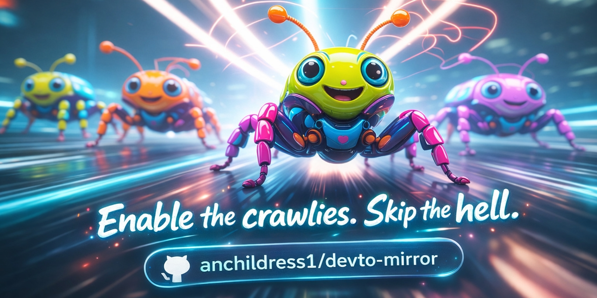
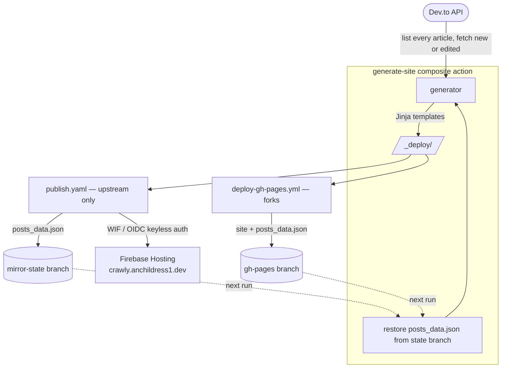

# Dev.to Mirror—The Set-and-Forget AI Crawler

🔗 **Live Site:** [crawly.anchildress1.dev](https://crawly.anchildress1.dev)



This Copilot generated utility helps make your Dev.to blogs more discoverable by search engines by automatically generating and hosting a mirror site with `robots.txt` rules that welcome search engines and AI answer engines—but not AI training. Avoiding Dante's DevOps and the maintenance headache. This is a simple html, no frills approach with a sitemap and robots.txt—_that's it_ (although I'm slowly working through enhancements). If you're like me and treat some comments as mini-posts, you can selectively pull in the ones that deserve their own page.

> [!NOTE]
>
> I'm slowly accepting that one or two brave souls might actually read my strong (and usually correct) opinions. 😅 I'm also always looking for ways to improve AI results across the board, because... well, _somebody_ has to. 🧠
>
> The internet already changed—blink and you missed it. We don't Google anymore; we ask ChatGPT (the wise ones even ask for sources). 🤖
>
> - **When I searched**: my [Dev.to](https://dev.to/anchildress1) showed up just as expected
> - **When I asked Gemini and ChatGPT the same thing**: crickets. 🦗
>
> So yeah, obvious disconnect... Also, I'm _not_ hosting a blog on my domain (I'm a backend dev; hosting a pretty blog + analytics sounds like a relaxing afternoon with Dante's DevOps. Hard pass. 🔥🫠), but I still want control of `robots.txt.`
>
> **Enter the five-minute ChatGPT fix:** a tiny static mirror with canonicals back to **Dev.to**—no fuss—just (practically) instantly crawlable 😉🐜.
>
> P.S. "Five minutes" usually means two hours. Acceptable losses. 😅 And seriously, writing this blurb took longer than the code. 🤨 Alright.... **3 hours** (it took me an hour to get the picture just right, enough anyway) and lots of follow up work. Still worth it! 😅
>
>—Ashley 🦄

## Repo Stuff

[](./LICENSE)   

[](https://github.com/anchildress1/devto-mirror/actions/workflows/publish.yaml) [](https://github.com/anchildress1/devto-mirror/actions/workflows/codeql.yml) [](https://github.com/anchildress1/devto-mirror/actions/workflows/security-ci.yml)

     

 

  

<!-- prettier-ignore-start -->
<!--START_SECTION:rai-badge-->

<!--END_SECTION:rai-badge-->
<!-- prettier-ignore-end -->

 [](https://www.buymeacoffee.com/anchildress1) [](https://dev.to/anchildress1) [](https://www.linkedin.com/in/anchildress1/) [](https://medium.com/@anchildress1) [](https://www.reddit.com/user/anchildress1/)

---

## What is this?

Auto-generates a static mirror of your Dev.to blog that search engines and AI assistants can read freely, while opting out of AI training. Plain HTML, sitemap, canonical links back to Dev.to—zero maintenance. Post pages carry schema.org `BlogPosting` JSON-LD and links to related posts so search engines and LLMs can actually parse it.

It runs weekly on your fork, fetches only new or edited articles, and deploys itself. You set two repo variables and walk away.

---

## Tech Stack

| Layer | What's used |
| --- | --- |
| Language | Python **3.12+** |
| Package manager | [`uv`](https://docs.astral.sh/uv/) (locked, reproducible) |
| Templating | Jinja2 → static HTML |
| Content safety | `bleach` HTML sanitization |
| Upstream deploy | **Firebase Hosting** (keyless, via Workload Identity Federation) |
| Fork deploy | **GitHub Pages** (`gh-pages` branch) |
| CI/CD | GitHub Actions (composite action shared by both deploy paths) |
| Analytics (optional) | Firebase Analytics (GA4), opt-in via `FIREBASE_WEB_CONFIG` |
| Quality gates | Black, flake8, isort, bandit, pip-audit, detect-secrets, radon, Lefthook |

---

## Architecture

One generator, two deploy targets. The upstream repo (owner `anchildress1`) ships to Firebase; **forks ship to GitHub Pages**. A shared composite action guarantees both produce identical output. The only state is the article store, `posts_data.json`: upstream keeps it on a dedicated `mirror-state` branch, forks keep it on `gh-pages` next to the site.


```mermaid
%%{init: {"theme": "default"}}%%
flowchart TD
    accTitle: Dev.to Mirror build and deploy pipeline
    accDescr: The shared generate-site action restores posts_data.json from the state branch, the generator syncs it against the Dev.to API and renders the whole site into _deploy, then publish.yaml deploys to Firebase Hosting and saves the store to mirror-state upstream, while deploy-gh-pages.yml publishes site and store together to gh-pages on forks. The next run restores the store from that branch.

    devto([Dev.to API]) -->|list every article, fetch new or edited| gen
    subgraph action [generate-site composite action]
        restore[restore posts_data.json from state branch] --> gen[generator]
        gen -->|Jinja templates| out[/"_deploy/"/]
    end
    out --> pub[publish.yaml — upstream only]
    out --> ghp[deploy-gh-pages.yml — forks]
    pub -->|WIF / OIDC keyless auth| fb[Firebase Hosting<br/>crawly.anchildress1.dev]
    pub -->|posts_data.json| ms[(mirror-state branch)]
    ghp -->|site + posts_data.json| gp[(gh-pages branch)]
    ms -.next run.-> restore
    gp -.next run.-> restore
```

---

## Quick Setup ⚡

These steps cover the **fork path** (GitHub Pages)—what almost everyone wants. The Firebase path is upstream-only; see [Configuration](#configuration) for those extras.

1. **Fork** this repo.
2. **Set repository variables** (Settings → Secrets and variables → Actions → Variables):
   - `DEVTO_USERNAME` – your Dev.to username
   - `GH_USERNAME` – your GitHub username (required unless you set a custom domain)
   - `SITE_DOMAIN` – _(optional)_ custom domain like `crawly.anchildress1.dev` (bare domain—it becomes the Pages `CNAME`)
3. **(Optional) Set a secret** (same page → Secrets):
   - `DEVTO_KEY` – Dev.to API key; only raises API rate limits
4. **Update** `comments.txt` to pick which comments become standalone pages—one `URL | optional context` per line (or delete it).
5. **Run the workflow**: Actions → **Deploy Dev.to Mirror to GitHub Pages** → Run workflow. This creates the `gh-pages` branch, or replaces the contents of one inherited from upstream.
6. **Enable Pages**: Settings → Pages → Deploy from a branch → `gh-pages`.

After that it pulls new content automatically every **Wednesday at 14:40 UTC** (≈09:40 ET in winter, 10:40 ET during DST).

> [!IMPORTANT]
> Forks publish to GitHub Pages via `deploy-gh-pages.yml`, with the article store (`posts_data.json`) riding along on the `gh-pages` branch. The upstream repo deploys to **Firebase Hosting** (`publish.yaml`) and keeps its store on a separate `mirror-state` branch. To refetch every article, trigger the workflow with the `force_full_regen` option.

---

## Configuration

Everything is driven by repository variables and secrets—no config files to edit.

### Everyone (fork or upstream)

| Name | Type | Required | Purpose |
| --- | --- | --- | --- |
| `DEVTO_USERNAME` | Variable | ✅ | Dev.to profile to mirror |
| `GH_USERNAME` | Variable | ✅ (unless `SITE_DOMAIN` set) | Builds the GitHub Pages URL |
| `SITE_DOMAIN` | Variable | optional | Custom domain; overrides the Pages/Firebase URL |
| `DEVTO_KEY` | Secret | optional | Dev.to API key—only raises API rate limits (just public endpoints are called) |

### Upstream-only (Firebase deploy)

| Name | Type | Required | Purpose |
| --- | --- | --- | --- |
| `GCP_WORKLOAD_IDENTITY_PROVIDER` | Variable | ✅ for Firebase | Full WIF provider resource name (keyless auth) |
| `GCP_DEPLOY_SERVICE_ACCOUNT` | Variable | ✅ for Firebase | Deploy SA email (needs `roles/firebasehosting.admin`) |
| `FIREBASE_PROJECT_ID` | Variable | optional | Firebase project id (defaults to `anchildress1`); without `SITE_DOMAIN`, the site URL is `<id>.web.app` |
| `FIREBASE_WEB_CONFIG` | Variable | optional | Firebase web config JSON; enables **opt-in** GA4 Analytics when set |

> [!NOTE]
> The Firebase web config is **public by design**—it's safe as a plain repo variable, not a secret. Analytics stays dormant until `FIREBASE_WEB_CONFIG` is set, so forks ship zero tracking.

---

## How it works

One command does everything: `python -m devto_mirror.site_generation.generator`.

1. **Sync.** It lists every article on your Dev.to profile and compares each one's latest activity (published or edited) with the stored copy in `posts_data.json`. Only new or edited articles are fetched in full; articles Dev.to no longer lists are dropped from the store.
2. **Render.** It rebuilds the whole site into `_deploy/` from the Jinja templates in `src/devto_mirror/templates/`:
   - `posts/<slug>.html` — one page per article, with `BlogPosting` JSON-LD and up to five related posts ranked by shared tags
   - `comments/<id>.html` — one page per line of `comments.txt`
   - `index.html`, `sitemap.xml` (absolute URLs), `robots.txt`, `llms.txt`

Every page's canonical URL points at Dev.to: the article's own canonical (falling back to its Dev.to URL), your Dev.to profile for the index, and the comment itself for comment pages.

Timeouts, rate limits (429), and 5xx responses are retried with backoff, honoring `Retry-After`. Anything still failing after that fails the run, so a partial site never deploys and the store is never overwritten with half a fetch. If Dev.to lists zero articles, or a sync would drop more than half the stored ones, the generator refuses to publish rather than gut the site.

**Force full regeneration:** trigger either deploy workflow with `force_full_regen: true` to ignore the store and refetch every article. It's also the way past the drop-half guard after a genuine mass deletion.

> [!WARNING]
> Root-level `robots.txt` / `llms.txt` (served from `username.github.io` rather than the project path) isn't wired up yet. [Google Search Console](https://search.google.com/search-console) can have trouble finding them at the project path. If you need root-level crawler files, copy `robots.txt` and `llms.txt` into your root user/org Pages repo manually.

### Crawler policy

The mirror is for being *found*, not for being scraped into a training set:

- **Search engines** (Googlebot, Bingbot, …) and **AI answer engines** fetching pages live—OAI-SearchBot, ChatGPT-User, Claude-SearchBot, Claude-User, PerplexityBot—may crawl everything.
- **AI training crawlers** (GPTBot, ClaudeBot, Google-Extended, Applebot-Extended, meta-externalagent, CCBot, Bytespider, and a few dataset scrapers) are disallowed in `robots.txt`.
- `robots.txt` also declares `Content-Signal: search=yes, ai-input=yes, ai-train=no`. Every page carries `noai, noimageai` in its robots meta and `<meta name="tdm-reservation" content="1">`, the W3C TDMRep flag that reserves text-and-data-mining rights (the EU DSM opt-out); it covers mining broadly, so `robots.txt` is where live retrieval is explicitly welcomed.
- `llms.txt` lists every mirrored page with its Dev.to canonical and states the same terms.

Two caveats worth knowing. These are signals, not locks: well-behaved crawlers honor them, others don't. And some vendors bundle training with other AI uses: Google files Gemini *grounding* under the same `Google-Extended` token, and Meta's `meta-externalagent` also feeds its AI products, so blocking training keeps pages out of those too. Google Search, including AI Overviews, runs on Googlebot and is unaffected.

---

## Project Structure

```plaintext
devto-mirror/
├── src/devto_mirror/
│   ├── core/              # Dev.to API client, HTML sanitization, path/URL helpers,
│   │                      #   Jinja environment + optional Firebase Analytics
│   ├── site_generation/   # generator.py (entry point), post.py (Post model),
│   │                      #   seo.py (JSON-LD + related posts)
│   └── templates/         # base, post, index, comment pages; sitemap.xml, robots.txt, llms.txt
├── scripts/               # security helpers (check_detect_secrets, run_pip_audit)
├── tests/                 # unittest suite (85% coverage gate)
├── assets/                # banner + social image
├── comments.txt           # comments to publish as standalone pages
├── .github/
│   ├── workflows/         # publish.yaml (Firebase), deploy-gh-pages.yml (forks),
│   │                      #   security-ci.yml, codeql.yml, release-please.yml, rai-attribution.yml
│   └── actions/generate-site/   # composite action shared by both deploy workflows
├── docs/                  # deep-dive guides (start at docs/README.md)
├── Makefile               # make install / ai-checks / test / ...
├── pyproject.toml         # dependencies (managed by uv)
└── lefthook.yml           # pre-commit + pre-push git hooks
```

---

## Local Development

```bash
git clone https://github.com/anchildress1/devto-mirror.git
cd devto-mirror

# Install uv if you don't have it
curl -LsSf https://astral.sh/uv/install.sh | sh

# Install dependencies and Lefthook git hooks
make install

# Configure environment
cp .env.example .env
# Edit .env with your DEVTO_USERNAME and GH_USERNAME

# Build the site locally into _deploy/ (also writes posts_data.json; both gitignored)
make dev

# Run the full validation suite (format, lint, security, complexity, tests)
make ai-checks
```

`make install` wires up Lefthook so `pre-commit` (format, lint, security) and `pre-push` (tests, complexity, actionlint) run automatically. Full details in the [Development Guide](./docs/DEV_GUIDE.md).

---

## Documentation 📚

Deep-dive docs live in [`docs/`](./docs/) (index: [`docs/README.md`](./docs/README.md)):

- [Development Guide](./docs/DEV_GUIDE.md) — local setup, environment variables, validation pipeline
- [CI/CD Guide](./docs/CI_GUIDE.md) — workflow architecture, Firebase + Pages deploy paths
- [Security Analysis](./docs/SECURITY_ANALYSIS.md) — security posture and recommendations

---

## License 📄

Every project has to have a stack of fine print somewhere. _Keep going, keep going, keep going..._ Here's mine, as painless as possible:

You know where [the license](./LICENSE) is, but I'll sum it up: **this is not open source** (even though you can still do just about anything you want with it). It's [Polyform Shield 1.0.0](./LICENSE)—as long as you're not turning it into the next big SaaS or selling subscriptions in the cloud, then have fun! Else, **you've gotta ask me first.**

Basically? This project's got boundaries. Be cool, don't try to sneak it into a product launch, and we'll get along just fine. 😘
